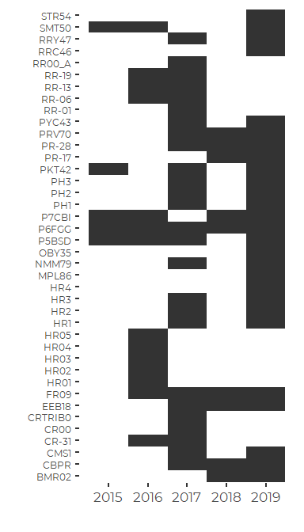

Compare DEP and FOCB Nutrient Data
================
Curtis C. Bohlen, Casco Bay Estuary Partnership.
06/07/2021

-   [Load Libraries](#load-libraries)
-   [Folder References](#folder-references)
-   [Load Data](#load-data)
    -   [DEP Data](#dep-data)
    -   [FOCB Data](#focb-data)
    -   [Combine Data](#combine-data)
    -   [Restrict to Recent Surface
        Samples](#restrict-to-recent-surface-samples)
    -   [Filter Out Data From Sites with Few
        Samples](#filter-out-data-from-sites-with-few-samples)
-   [Output Resulting data](#output-resulting-data)
-   [Evaluate Prevalence of Data By
    Year](#evaluate-prevalence-of-data-by-year)
-   [Data Summary](#data-summary)
    -   [TN Results](#tn-results)
    -   [DIN Results](#din-results)


\#Introduction This repository was created to compare nutrient data
received from Friends of Casco Bay and from Maine DEP. Initially, this
was to ensure that we are not double counting nutrient samples. When we
discovered that there is little or no sample overlap between the two
data sources, we extended the archive to combine data from both
sourcesinto one data set for display purposes.

There is no “Original\_Data” folder for this repository. All data was
derived from sources in “DEP\_nutrients” and “FOCB\_Nutrients”
repositories, and copied here.

“DEP\_nutrients” -&gt; ‘dep\_nutrient\_data.csv’ “FOCB\_Nutrients” -&gt;
‘focb\_n\_data\_strict.csv’

In this notebook, we use a simple strategy, using `inner_join()` to
check for samples that match with regards to date and site, and examine
the TN and NOx data from the two sources to see if they are similar.

We find only four samples where DEP and FOCB sampled the same location
on the same dates. Reported TN and NOx values do not match. We conclude
that these are independent data sources.

# Load Libraries

``` r
library(tidyverse)
#> Warning: package 'tidyverse' was built under R version 4.0.5
#> -- Attaching packages --------------------------------------- tidyverse 1.3.1 --
#> v ggplot2 3.3.5     v purrr   0.3.4
#> v tibble  3.1.6     v dplyr   1.0.7
#> v tidyr   1.1.4     v stringr 1.4.0
#> v readr   2.1.0     v forcats 0.5.1
#> Warning: package 'ggplot2' was built under R version 4.0.5
#> Warning: package 'tidyr' was built under R version 4.0.5
#> Warning: package 'dplyr' was built under R version 4.0.5
#> Warning: package 'forcats' was built under R version 4.0.5
#> -- Conflicts ------------------------------------------ tidyverse_conflicts() --
#> x dplyr::filter() masks stats::filter()
#> x dplyr::lag()    masks stats::lag()

library(GGally)
#> Warning: package 'GGally' was built under R version 4.0.5
#> Registered S3 method overwritten by 'GGally':
#>   method from   
#>   +.gg   ggplot2

library(CBEPgraphics)
load_cbep_fonts()
theme_set(theme_cbep())
```

# Folder References

``` r
sibfldnm <- 'Derived_Data'
parent <- dirname(getwd())
sibling <- file.path(parent,sibfldnm)
```

# Load Data

## DEP Data

``` r
fn <- 'dep_nutrient_data.csv'

dep_data <- read_csv(file.path(sibling, fn )) %>%
  select(site, dt, depth, nox_n, nh4_n, tn) %>%
  mutate(din = nox_n + nh4_n) %>%
  filter(! is.na(tn) & ! is.na(din)) %>%
  select(-nh4_n, -nox_n) %>%
  mutate(source = 'DEP') %>%
  relocate(source) %>%
  pivot_longer(c(din, tn), names_to = 'parameter', values_to = 'concentration')
#> Rows: 497 Columns: 35
#> -- Column specification --------------------------------------------------------
#> Delimiter: ","
#> chr   (6): site_name, site, depth_designation, month, Sample Comments, Valid...
#> dbl  (13): year, hour, depth, chl, phaeo, nox_n, nh4_n, tn, op_p, tp, tss, L...
#> lgl  (14): chl_cens, chl_flag, phaeo_flag, phaeo_cens, nox_n_cens, nox_n_fla...
#> date  (1): dt
#> time  (1): time
#> 
#> i Use `spec()` to retrieve the full column specification for this data.
#> i Specify the column types or set `show_col_types = FALSE` to quiet this message.
```

## FOCB Data

``` r
fn <- 'focb_n_data_strict.csv'

focb_data <- read_csv(file.path(sibling, fn )) %>%
  select(station, dt, tn_depth, din_depth, din_N, tn) %>%
  filter(! is.na(tn) & ! is.na(din_N)) %>%
  rename(site = station) %>%
  mutate(source = 'FOCB') %>%
  rename(din = din_N) %>%
  relocate(source) %>%
  pivot_longer(c(din, tn), 
               names_to = 'parameter', 
               values_to = 'concentration') %>%
  mutate(depth = if_else(parameter == 'tn', tn_depth, din_depth)) %>%
  select(-tn_depth, -din_depth) %>%
  relocate(depth , .after = 'dt')
#> Rows: 3324 Columns: 16
#> -- Column specification --------------------------------------------------------
#> Delimiter: ","
#> chr   (2): station, month
#> dbl  (13): year, yearf, doy, tn_depth, din_depth, tn, nox, nh4, din, din_N, ...
#> dttm  (1): dt
#> 
#> i Use `spec()` to retrieve the full column specification for this data.
#> i Specify the column types or set `show_col_types = FALSE` to quiet this message.
```

## Combine Data

``` r
mixed_data <- dep_data %>% bind_rows(focb_data) %>%
  mutate(year  = as.numeric(format(dt, format = '%Y')),
         month = as.numeric(format(dt, format = '%m')),
         month = factor(month, 
                        levels = 1:12, 
                        labels = month.abb),
         doy   = as.numeric(format(dt, format = '%j'))) %>%
  mutate(parameter = factor(parameter, 
                            levels = c('din', 'tn'), 
                            labels = c('DIN', 'TN'))) %>%
  relocate(year, month, doy, .after = dt)
```

## Restrict to Recent Surface Samples

``` r
surface_data <- mixed_data %>%
  filter(depth <= 1, year > 2014)
```

## Filter Out Data From Sites with Few Samples

We filter out data for each parameter from any sites that did not have
at least five samples for that parameter since 2015. We add data on the
number of years each site was sampled.

``` r
surface_data <- surface_data %>%
  group_by(site) %>%
  mutate(nTN = sum(parameter == 'TN'),
         nDIN = sum(parameter == 'DIN')) %>%
  mutate(concentration = if_else(parameter == 'TN' & nTN < 5, 
                                NA_real_, 
                                concentration)) %>%
  mutate(concentration = if_else(parameter == 'DIN' & nDIN < 5, 
                                NA_real_, 
                                concentration)) %>%
  ungroup(site) %>%
  select(-nTN, -nDIN, -depth) %>%
  filter(! is.na(concentration))
```

# Output Resulting data

``` r
write_csv(surface_data, file.path(sibling, "combined_surface_data.csv"))
```

# Evaluate Prevalence of Data By Year

``` r
prevalence <- surface_data %>%
  group_by(site, year) %>%
  summarize(nTN = sum(parameter == 'TN'),
         nDIN = sum(parameter == 'DIN'),
         sampledTN = nTN > 0,
         sampledDIN = nDIN > 0,
         .groups = 'drop_last')
```

``` r
prevalence %>%
  ggplot(aes(year, site)) +
  geom_tile() +
  xlab('') +
  ylab('') +
  theme(axis.text.y = element_text(size = 9))
```


So a fair number of sites were sampled in only one year, especially by
DEP. If we drop all those locations, we end up with a much reduced
number of locations we can show on the map. We chose to hold onto all
possible sites with at least five samples.

# Data Summary

There are a handful of replicate or near replicate values, or at least
samples collected at the same date and site. Al lare in the FOCB data,
and probably only represent data nominally collected from different
depths (DIN and TN depths were often recorded differently). To address
that, we average across all samples collected at one site and date by
each organization **before** we calculate descriptive statistics.

``` r
surface_results <- surface_data %>%
  pivot_wider(id_cols = source:doy, 
              names_from = parameter, 
              values_from = concentration,
              values_fn = function(x) mean(x, na.rm = TRUE)) %>%
  group_by(site) %>%
  summarize(across(.cols = c(DIN, TN),
                   .fns = c(mn = ~ mean(.x, na.rm = TRUE),
                            sd = ~ sd(.x, na.rm = TRUE), 
                            n = ~sum(! is.na(.x)),
                            md = ~ median(.x, na.rm = TRUE),
                            iqr = ~ IQR(.x, na.rm = TRUE),
                            p90 = ~ quantile(.x, .9, na.rm = TRUE),
                            gm = ~ exp(mean(log(.x), na.rm = TRUE)))),
            .groups = 'drop') %>%
  mutate(site = fct_reorder(factor(site), TN_md))
```

## TN Results

``` r
surface_results %>%
  select(site, contains('TN'))
#> # A tibble: 40 x 8
#>    site    TN_mn  TN_sd  TN_n TN_md TN_iqr TN_p90 TN_gm
#>    <fct>   <dbl>  <dbl> <int> <dbl>  <dbl>  <dbl> <dbl>
#>  1 BMR02   0.345 0.186     22 0.294 0.162   0.456 0.314
#>  2 CBPR    0.294 0.0863    21 0.289 0.083   0.4   0.282
#>  3 CMS1    0.220 0.0862     9 0.179 0.0541  0.287 0.210
#>  4 CR-31   0.444 0.236      7 0.391 0.298   0.766 0.396
#>  5 CR00    0.65  0.193      6 0.691 0.274   0.837 0.622
#>  6 CRTRIB0 0.770 0.351      6 0.714 0.429   1.15  0.706
#>  7 EEB18   0.316 0.134     26 0.282 0.133   0.480 0.293
#>  8 FR09    0.318 0.123     24 0.292 0.120   0.422 0.300
#>  9 HR01    0.335 0.0965     7 0.359 0.0925  0.418 0.320
#> 10 HR02    0.389 0.153      7 0.311 0.220   0.587 0.364
#> # ... with 30 more rows
```

## DIN Results

``` r
surface_results %>%
  select(site, contains('DIN'))
#> # A tibble: 40 x 8
#>    site    DIN_mn DIN_sd DIN_n DIN_md DIN_iqr DIN_p90 DIN_gm
#>    <fct>    <dbl>  <dbl> <int>  <dbl>   <dbl>   <dbl>  <dbl>
#>  1 BMR02   0.257  0.852     22 0.0594 0.0431   0.111  0.0695
#>  2 CBPR    0.269  0.867     21 0.047  0.056    0.137  0.0708
#>  3 CMS1    0.0206 0.0296     9 0.0107 0.00667  0.0346 0.0131
#>  4 CR-31   0.174  0.138      7 0.114  0.156    0.371  0.133 
#>  5 CR00    0.312  0.163      6 0.322  0.213    0.484  0.271 
#>  6 CRTRIB0 0.216  0.209      6 0.138  0.34     0.476  0.125 
#>  7 EEB18   0.230  0.781     26 0.0675 0.0585   0.119  0.0694
#>  8 FR09    0.0920 0.110     24 0.0620 0.0618   0.129  0.0591
#>  9 HR01    0.0547 0.0408     7 0.045  0.0190   0.0906 0.0442
#> 10 HR02    0.0599 0.0264     7 0.073  0.0385   0.0834 0.0539
#> # ... with 30 more rows
```
