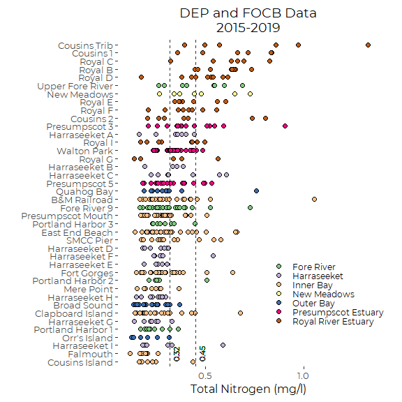
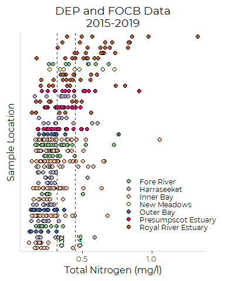
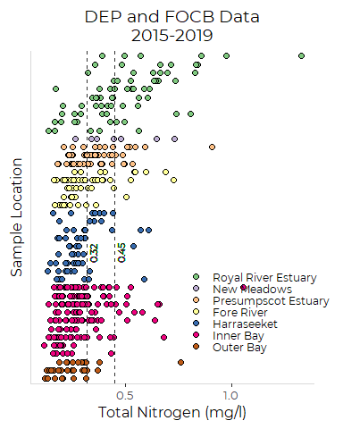
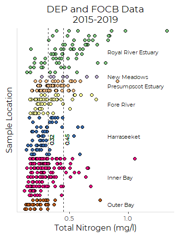

Graphics for DEP and FOCB Nutrient Data
================
Curtis C. Bohlen, Casco Bay Estuary Partnership.
06/07/2021

-   [Introduction](#introduction)
-   [Load Libraries](#load-libraries)
-   [Folder References](#folder-references)
-   [Load Data](#load-data)
-   [Remove Questionable Extreme
    Values](#remove-questionable-extreme-values)
-   [Add Location, Site Names and
    Regions](#add-location-site-names-and-regions)
-   [Data Summary](#data-summary)
-   [Graphics](#graphics)
    -   [TN Graphic by TN](#tn-graphic-by-tn)
        -   [Order Sites in Rank Order of
            TN](#order-sites-in-rank-order-of-tn)
        -   [Create Base Plot](#create-base-plot)
    -   [TN Graphic By Region](#tn-graphic-by-region)
        -   [Order Sites in Region](#order-sites-in-region)
    -   [With Labels, Not Legend](#with-labels-not-legend)
        -   [Calculate Y Coordinates](#calculate-y-coordinates)
        -   [Add Labels](#add-labels)


# Introduction

This repository was created to compare nutrient data received from
Friends of Casco Bay and from Maine DEP. Initially, this was to to
ensure that we are not double counting nutrient samples. When we
discovered that there is little or no sample overlap between the two
data sources, we extended the archive to combine data from both sources
into one data set for display purposes.

# Load Libraries

``` r
library(tidyverse)
#> -- Attaching packages --------------------------------------- tidyverse 1.3.1 --
#> v ggplot2 3.3.5     v purrr   0.3.4
#> v tibble  3.1.6     v dplyr   1.0.7
#> v tidyr   1.1.4     v stringr 1.4.0
#> v readr   2.1.1     v forcats 0.5.1
#> -- Conflicts ------------------------------------------ tidyverse_conflicts() --
#> x dplyr::filter() masks stats::filter()
#> x dplyr::lag()    masks stats::lag()

library(GGally)
#> Registered S3 method overwritten by 'GGally':
#>   method from   
#>   +.gg   ggplot2

library(CBEPgraphics)
load_cbep_fonts()
theme_set(theme_cbep())
```

# Folder References

``` r
sibfldnm <- 'Data'
parent <- dirname(getwd())
sibling <- file.path(parent,sibfldnm)

dir.create(file.path(getwd(), 'figures'), showWarnings = FALSE)
```

# Load Data

``` r
fn <- 'combined_surface_data.csv'

surface_data <- read_csv(file.path(sibling, fn )) %>%
  mutate(source = factor(source), 
         site = factor(site),
         month = factor(month, levels = month.abb),
         parameter = factor(parameter))
#> Rows: 954 Columns: 8
#> -- Column specification --------------------------------------------------------
#> Delimiter: ","
#> chr  (4): source, site, month, parameter
#> dbl  (3): year, doy, concentration
#> dttm (1): dt
#> 
#> i Use `spec()` to retrieve the full column specification for this data.
#> i Specify the column types or set `show_col_types = FALSE` to quiet this message.
```

# Remove Questionable Extreme Values

We remove two extreme values from the FOCB TN data. While these values
were not flagged as errors in the source data, they appear likely to
represent errors based on QC review. Details of teh QA/QC review are in
the archve describing initial analysis of the FOCB nutrients data.

``` r
surface_data <- surface_data %>%
  filter(! (parameter == 'TN' & concentration > 1.5))
```

# Add Location, Site Names and Regions

``` r
fn <- 'combined_locations.csv'

locations <- read_csv(file.path(sibling, fn)) %>%
  mutate(source = factor(source), 
         site = factor(site)) %>%
  rename(loc_sources = source)
#> Rows: 63 Columns: 7
#> -- Column specification --------------------------------------------------------
#> Delimiter: ","
#> chr (5): site, site_name, short_name, source, region
#> dbl (2): latitude, longitude
#> 
#> i Use `spec()` to retrieve the full column specification for this data.
#> i Specify the column types or set `show_col_types = FALSE` to quiet this message.
```

``` r
surface_data <- surface_data %>%
  left_join(locations, by = 'site') %>%
  relocate(site_name, short_name, region, loc_sources, .after = site)
```

# Data Summary

There are a handful of replicate or near replicate values, or at least
samples collected at the same date and site. All are in the FOCB data,
and probably only represent data nominally collected from different
depths (DIN and TN depths were often recorded differently). To address
that, we average across all samples collected at one site and date by
each organization BEFORE we calculate descriptive statistics.

``` r
surface_results <- surface_data %>%
  relocate(latitude, longitude, .after = region) %>%
  pivot_wider(id_cols = source:doy, 
              names_from = parameter, 
              values_from = concentration,
              values_fn = function(x) mean(x, na.rm = TRUE)) %>%
  group_by(site, short_name, region, loc_sources, latitude, longitude) %>%
  summarize(across(.cols = c(DIN, TN),
                   .fns = c(mn = ~ mean(.x, na.rm = TRUE),
                            sd = ~ sd(.x, na.rm = TRUE), 
                            n = ~sum(! is.na(.x)),
                            md = ~ median(.x, na.rm = TRUE),
                            iqr = ~ IQR(.x, na.rm = TRUE),
                            p90 = ~ quantile(.x, .9, na.rm = TRUE),
                            gm = ~ exp(mean(log(.x), na.rm = TRUE)))),
            .groups = 'drop') %>%
  mutate(site = fct_reorder(factor(site), TN_md),
         short_name = fct_reorder(factor(short_name), TN_md),
         region = factor(region))
```

# Graphics

## TN Graphic by TN

### Order Sites in Rank Order of TN

``` r
surface_data <- surface_data %>%
mutate(site = factor(site, levels = levels(surface_results$site)),
       short_name = factor(short_name, 
                           levels = levels(surface_results$short_name)))
```

### Create Base Plot

``` r
plt <- surface_data %>%
  filter(parameter == 'TN') %>%
  ggplot(aes(concentration, short_name)) +
  
  geom_point(aes(fill = region), shape = 21, size = 2) +
  #stat_summary(geom = 'point', fun = median, shape = 3, size = 2.5) +
  
  scale_fill_brewer(palette = 'Accent', name = '') +
  
  ylab('') +
  xlab('Total Nitrogen (mg/l)') +
  theme_cbep(base_size = 12) +
  theme(legend.position = c(.80, .25),
        legend.text = element_text(size = 9),
        legend.key.height = unit(5, 'pt'),
        plot.margin  = unit(c(8,24,8,8), 'pt'),
        plot.title = element_text(hjust = 0.5))
```

``` r
plt + 
  geom_vline(xintercept = 0.32, color = cbep_colors()[3], lty = 2) +
  geom_text(aes(x = 0.35, y = 1, label = '0.32'), 
            angle = 90, hjust = 0, size = 3,
                color = cbep_colors()[3]) +
  geom_vline(xintercept = 0.45, color = cbep_colors()[3], lty = 2) +
  geom_text(aes(x = 0.48, y = 1, label = '0.45'), 
            angle = 90, hjust = 0, size = 3,
                color = cbep_colors()[3]) +
  labs(title = 'DEP and FOCB Data\n2015-2019')
```



``` r
ggsave('figures/tn_by_site_by_tn.pdf', device = cairo_pdf, width = 6, height = 6)
```

``` r
plt +
  
  ylab('Sample Location') +
  
  theme(axis.text.y=element_blank(),
        axis.ticks.y=element_blank(),
        axis.line = element_line(color = 'gray85'))  +
  
  geom_vline(xintercept = 0.32, color = cbep_colors()[3], lty = 2) +
  geom_text(aes(x = 0.35, y = 1, label = '0.32'), 
            angle = 90, hjust = 0, size = 3,
                color = cbep_colors()[3]) +
  geom_vline(xintercept = 0.45, color = cbep_colors()[3], lty = 2) +
  geom_text(aes(x = 0.48, y = 1, label = '0.45'), 
            angle = 90, hjust = 0, size = 3,
                color = cbep_colors()[3]) +
  labs(title = 'DEP and FOCB Data\n2015-2019')
```



``` r
ggsave('figures/tn_by_site_by_tn_no_labels.pdf', device = cairo_pdf, 
       width = 4, height = 5)
```

## TN Graphic By Region

### Order Sites in Region

We order Regions by Median TN value, then order sites within regions by
the same. Note that to get the final ordering the way we want on the
graphic, we SUBTRACT the median TN value.

``` r
surface_results <- surface_results %>%
  mutate(region = fct_reorder(region, TN_md, na.rm = TRUE, .desc = TRUE),
         site = fct_reorder2(site, region, TN_md, 
                             function(x,y) as.numeric(x) * 100 - y),
         short_name = fct_reorder2(short_name, region, TN_md, 
                             function(x,y) as.numeric(x) * 100 - y))
surface_data <- surface_data %>%
  mutate(region = factor(region, levels = levels(surface_results$region)),
         site = factor(site, levels = levels(surface_results$site)),
         short_name = factor(short_name, levels = levels(surface_results$short_name)))
```

``` r
plt <- surface_data %>%
  filter(parameter == 'TN') %>%
  ggplot(aes(concentration, short_name)) +

  geom_point(aes(fill = region), shape = 21, size = 2) +
  #stat_summary(geom = 'point', fun = median, shape = 3, size = 2.5) +
  
  scale_fill_brewer(palette = 'Accent', name = '') +
  
  ylab('Sample Location') +
  xlab('Total Nitrogen (mg/l)') +
  
  theme_cbep(base_size = 12) +
  theme(axis.text.y=element_blank(),
        axis.ticks.y=element_blank(),
        axis.line = element_line(color = 'gray85'),
        legend.position = c(.80, .25),
        legend.text = element_text(size = 9),
        legend.key.height = unit(5, 'pt'),
        plot.margin  = unit(c(8,24,8,8), 'pt'),
        plot.title = element_text(hjust = 0.5)) +
  labs(title = 'DEP and FOCB Data\n2015-2019') +

  geom_vline(xintercept = 0.32, color = cbep_colors()[3], lty = 2) +
  geom_text(aes(x = 0.35, y = 15, label = '0.32'), 
            angle = 90, hjust = 0, size = 3,
                color = cbep_colors()[3]) +
  geom_vline(xintercept = 0.45, color = cbep_colors()[3], lty = 2) +
  geom_text(aes(x = 0.48, y = 15, label = '0.45'), 
            angle = 90, hjust = 0, size = 3,
                color = cbep_colors()[3])
```

``` r
plt
```



``` r
ggsave('figures/tn_by_site_by_region_no_labels.pdf', device = cairo_pdf, 
       width = 4, height = 5)
```

## With Labels, Not Legend

### Calculate Y Coordinates

We want to place labels in the “middle” of the list of entries that
correspond to each region. So, we want to identify median row position
for each group.

``` r
n_sites <- length(levels(surface_results$site))
lab_positions <- surface_results %>%
  group_by(region) %>%
  summarize(y_pos = median(as.numeric(site)), .groups = 'drop') %>%
  mutate(x_pos = .825)
```

### Add Labels

``` r
plt +
  
  theme(legend.position = 'none',
        #plot.margin  = unit(c(8,24,8,8), 'pt')
        ) +
  geom_text(data = lab_positions, 
            mapping = aes(x = x_pos, y = y_pos, label = region),
            hjust = 0, size = 3)
```



``` r
ggsave('figures/tn_by_site_by_region_final.pdf', device = cairo_pdf, 
       width = 4, height = 5)
```
